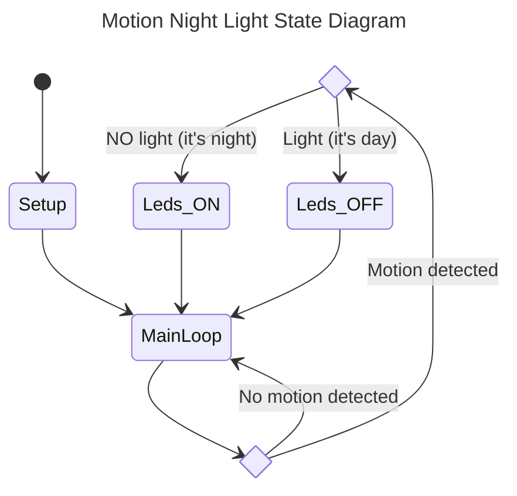

# Motion Night Light

This is a simple motion detect-triggered night light using arduino compatible micro module.

## State Machine

The following is  the state machine of this device.

## Circuitary

The following diagram is illustrated the electronic componets and the related wiring.

Fell free to change the analog or digital ports as you like. Just remember to modify the code th mach your changes.

[draw.io source file here](https://github.com/arabed/motion-night-light/blob/main/docs/circuit-diagram.drawio)

## enclosure

I designed a simple enclosure for this project.

You can find the STL files for [front cover here](https://github.com/arabed/motion-night-light/blob/main/docs/Motion%20Night%20Light%20v19.stl) and [back cover here](https://github.com/arabed/motion-night-light/blob/main/docs/Motion%20Night%20Light%20-%20cover%20v5.stl).

## Reference

The Pro Micro pinout for reference:

