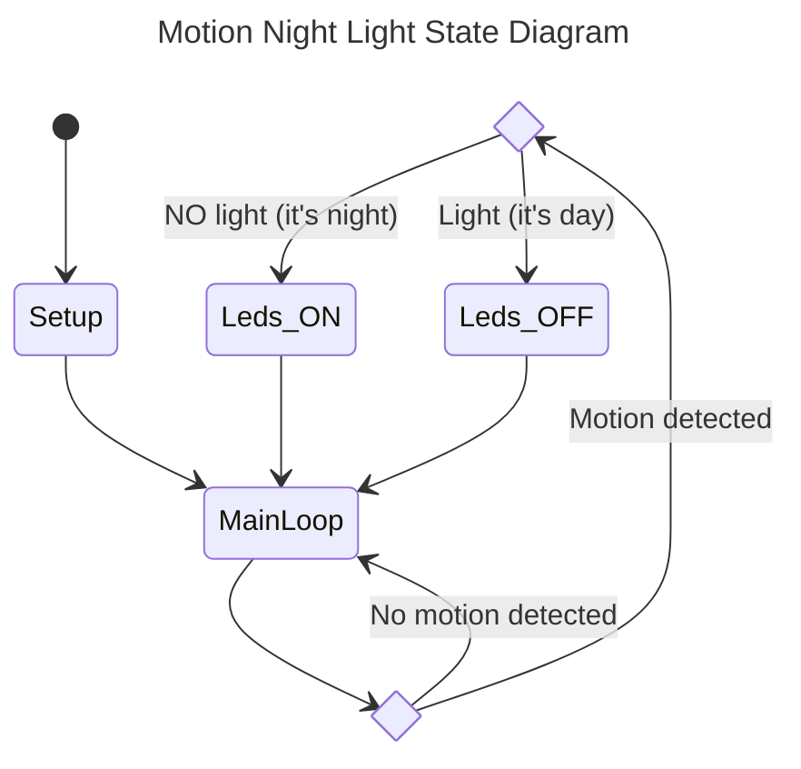

# motion-night-light

This is a simple motion detect-triggered night light using arduino compatible micro module.

The following is  the state machine of this device.

## Circuitary

The following diagram is illustrated the electronic componets and the related wiring.

Fell free to chnage the analog or digital ports as you like. Just remember to modify the code th mach your changes.

## enclosure

I designed a simple enclosure for this project here. Please feel free to use it as you like.
